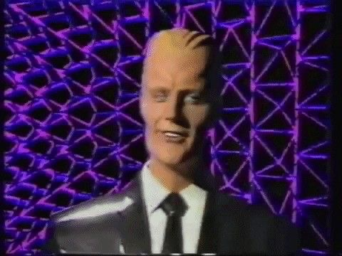

<!--
  ZIMBRA :: PUBLIC BROADCAST README
  Retro-futurist profile inspired by 80s signal hijack aesthetics.
-->

  

 

   
  
  <h3>Software Engineering | Networks | Offensive Security | Automation</h3>

  

    
    
    
  

<pre align="center"><code>+----------------------------------------------------------------------------+
| SIGNAL: ZIMBRA_NODE_ACTIVE                                                  |
| MODE  : RETRO-FUTURE BROADCAST / ENGINEERING TERMINAL                       |
| FOCUS : SOFTWARE, TCP/IP, LINUX, CYBERSECURITY, AUTOMATION                  |
| QUOTE : "Catch the wave."                                                   |
+----------------------------------------------------------------------------+</code></pre>

<h2 align="center"><code>root@zimbra:~# whoami</code></h2>

  Software Engineering student focused on computer networks, offensive security,
  Linux systems and practical automation. I build socket-based applications,
  security labs, recon tooling, data workflows and systems that expose how
  software behaves below the interface layer.

<pre align="center"><code>operator:
  name: "Gabriel M. Zimbra"
  handle: "GZimbra"
  portfolio: "https://zimbra.space"
  role: "Software Engineering Student"
  timezone: "UTC-3 / Brazil"
  domains:
    - Computer Networks
    - Offensive Security
    - Linux Infrastructure
    - Backend Engineering
    - Automation
    - Applied AI</code></pre>

    

<h2 align="center"><code>root@zimbra:~# cat /etc/skillset</code></h2>

  <table>
    <tr>
      <th align="center">Area</th>
      <th align="center">Practical Stack</th>
    </tr>
    <tr>
      <td align="center"><strong>Backend / Systems</strong></td>
      <td align="center">C#, .NET, Python, sockets, process automation</td>
    </tr>
    <tr>
      <td align="center"><strong>Networks</strong></td>
      <td align="center">TCP/IP, DNS, HTTP, routing basics, packet inspection</td>
    </tr>
    <tr>
      <td align="center"><strong>Security</strong></td>
      <td align="center">Recon, enumeration, web security, Linux hardening, CTF labs</td>
    </tr>
    <tr>
      <td align="center"><strong>Linux / Ops</strong></td>
      <td align="center">Bash, services, logs, permissions, SSH, Docker</td>
    </tr>
    <tr>
      <td align="center"><strong>Data / AI</strong></td>
      <td align="center">Python pipelines, notebooks, PyTorch experiments</td>
    </tr>
    <tr>
      <td align="center"><strong>Workflow</strong></td>
      <td align="center">Git, GitHub, VS Code, terminal-first development</td>
    </tr>
  </table>

  

<h2 align="center"><code>root@zimbra:~# nmap -sV active-projects.local</code></h2>

  <table>
    <tr>
      <th align="center">Project Type</th>
      <th align="center">Stack</th>
      <th align="center">Objective</th>
    </tr>
    <tr>
      <td align="center"><strong>TCP client/server apps</strong></td>
      <td align="center">C# / .NET / sockets</td>
      <td align="center">Multiplayer and protocol-oriented applications</td>
    </tr>
    <tr>
      <td align="center"><strong>Recon automation</strong></td>
      <td align="center">Python / Bash</td>
      <td align="center">Enumeration, parsing and repeatable security workflows</td>
    </tr>
    <tr>
      <td align="center"><strong>Packet analysis labs</strong></td>
      <td align="center">Python / Wireshark / Scapy</td>
      <td align="center">Traffic inspection and protocol behavior analysis</td>
    </tr>
    <tr>
      <td align="center"><strong>Portfolio platform</strong></td>
      <td align="center">Web / Vercel</td>
      <td align="center">Public technical profile at <a href="https://zimbra.space">zimbra.space</a></td>
    </tr>
    <tr>
      <td align="center"><strong>CTF training</strong></td>
      <td align="center">TryHackMe / Linux</td>
      <td align="center">Offensive security practice and methodology building</td>
    </tr>
  </table>

<pre align="center"><code>22/tcp    open  linux-ops          ssh, permissions, services, logs
53/tcp    open  dns-analysis       resolution flow and record inspection
80/tcp    open  web-recon          enumeration, headers, content discovery
443/tcp   open  portfolio          https://zimbra.space
4444/tcp  open  lab-channel        controlled offensive security practice
9001/tcp  open  automation-core    Python and shell tooling</code></pre>

<h2 align="center"><code>root@zimbra:~# ./broadcast --style=max-headroom</code></h2>

<strong>"20 minutes into the future."</strong>

  This profile uses a broadcast-hijack visual language: black terminal surfaces,
  neon green, magenta signal noise, VHS compression, grid-room geometry and
  low-level system language. The goal is visual identity without sacrificing
  technical clarity.

  

<h2 align="center"><code>root@zimbra:~# ./fetch_stats --source=github</code></h2>

  

<h2 align="center"><code>root@zimbra:~# contact --establish-session</code></h2>

  <table>
    <tr>
      <th align="center">Channel</th>
      <th align="center">Endpoint</th>
    </tr>
    <tr>
      <td align="center">Portfolio</td>
      <td align="center"><a href="https://zimbra.space">https://zimbra.space</a></td>
    </tr>
    <tr>
      <td align="center">TryHackMe</td>
      <td align="center"><a href="https://tryhackme.com/p/iblamegabriel">tryhackme.com/p/iblamegabriel</a></td>
    </tr>
    <tr>
      <td align="center">Email</td>
      <td align="center"><a href="mailto:gabrielmzimbra@gmail.com">gabrielmzimbra@gmail.com</a></td>
    </tr>
  </table>

<pre align="center"><code>+ [OK] portfolio: online
+ [OK] terminal: armed
+ [OK] stack: loaded
+ [OK] signal: clean enough
! [SYS] end_of_transmission</code></pre>

  

