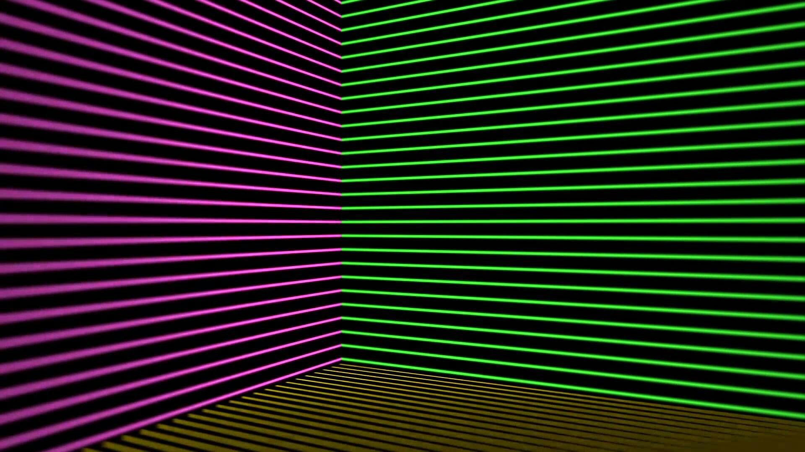

<!--
  ZIMBRA :: PUBLIC BROADCAST README
  Retro-futurist profile inspired by 80s signal hijack aesthetics.
-->

<div align="center">
  
</div>

<br />

<div align="center">
  

  <h1>GABRIEL M. ZIMBRA</h1>
  <h3>Software Engineering | Networks | Offensive Security | Automation</h3>

  <p>
    <a href="https://zimbra.space"></a>
    <a href="https://github.com/GZimbra"></a>
    <a href="https://tryhackme.com/p/iblamegabriel"></a>
    <a href="mailto:gabrielmzimbra@gmail.com"></a>
  </p>
</div>

```text
+----------------------------------------------------------------------------+
| SIGNAL: ZIMBRA_NODE_ACTIVE                                                  |
| MODE  : RETRO-FUTURE BROADCAST / ENGINEERING TERMINAL                       |
| FOCUS : SOFTWARE, TCP/IP, LINUX, CYBERSECURITY, AUTOMATION                  |
| QUOTE : "Catch the wave."                                                   |
+----------------------------------------------------------------------------+
```

## `root@zimbra:~# whoami`

Software Engineering student focused on computer networks, offensive security,
Linux systems and practical automation. I build socket-based applications,
security labs, recon tooling, data workflows and systems that expose how
software behaves below the interface layer.

```yaml
operator:
  name: "Gabriel M. Zimbra"
  handle: "GZimbra"
  portfolio: "https://zimbra.space"
  role: "Software Engineering Student"
  timezone: "UTC-3 / Brazil"
  domains:
    - Computer Networks
    - Offensive Security
    - Linux Infrastructure
    - Backend Engineering
    - Automation
    - Applied AI
```

<div align="center">
  
  
  
</div>

## `root@zimbra:~# cat /etc/skillset`

| Area | Practical Stack |
| :--- | :--- |
| **Backend / Systems** | C#, .NET, Python, sockets, process automation |
| **Networks** | TCP/IP, DNS, HTTP, routing basics, packet inspection |
| **Security** | Recon, enumeration, web security, Linux hardening, CTF labs |
| **Linux / Ops** | Bash, services, logs, permissions, SSH, Docker |
| **Data / AI** | Python pipelines, notebooks, PyTorch experiments |
| **Workflow** | Git, GitHub, VS Code, terminal-first development |

<div align="center">
  
</div>

## `root@zimbra:~# nmap -sV active-projects.local`

| Project Type | Stack | Objective |
| :--- | :--- | :--- |
| **TCP client/server apps** | C# / .NET / sockets | Multiplayer and protocol-oriented applications |
| **Recon automation** | Python / Bash | Enumeration, parsing and repeatable security workflows |
| **Packet analysis labs** | Python / Wireshark / Scapy | Traffic inspection and protocol behavior analysis |
| **Portfolio platform** | Web / Vercel | Public technical profile at [zimbra.space](https://zimbra.space) |
| **CTF training** | TryHackMe / Linux | Offensive security practice and methodology building |

```console
22/tcp    open  linux-ops          ssh, permissions, services, logs
53/tcp    open  dns-analysis       resolution flow and record inspection
80/tcp    open  web-recon          enumeration, headers, content discovery
443/tcp   open  portfolio          https://zimbra.space
4444/tcp  open  lab-channel        controlled offensive security practice
9001/tcp  open  automation-core    Python and shell tooling
```

## `root@zimbra:~# ./broadcast --style=max-headroom`

> "20 minutes into the future."

This profile uses a broadcast-hijack visual language: black terminal surfaces,
neon green, magenta signal noise, VHS compression, grid-room geometry and
low-level system language. The goal is visual identity without sacrificing
technical clarity.

<div align="center">
  
  
</div>

## `root@zimbra:~# ./fetch_stats --source=github`

<div align="center">
  
  
</div>

<div align="center">
  
</div>

## `root@zimbra:~# contact --establish-session`

| Channel | Endpoint |
| :--- | :--- |
| Portfolio | [https://zimbra.space](https://zimbra.space) |
| GitHub | [github.com/GZimbra](https://github.com/GZimbra) |
| TryHackMe | [tryhackme.com/p/iblamegabriel](https://tryhackme.com/p/iblamegabriel) |
| Email | [gabrielmzimbra@gmail.com](mailto:gabrielmzimbra@gmail.com) |

```diff
+ [OK] portfolio: online
+ [OK] terminal: armed
+ [OK] stack: loaded
+ [OK] signal: clean enough
! [SYS] end_of_transmission
```

<div align="center">
  
</div>
